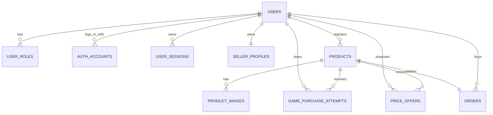

# Jinmarket Product Design

이 문서는 2026-03-29 기준 현재 저장소 구현 상태를 반영한 제품/프로젝트 설계 문서다.

## 1. 서비스 개요

Jinmarket은 여러 판매자가 자신의 물건을 등록하고, 로그인한 구매자가 아래 방식 중 하나로 구매할 수 있는 벼룩시장 서비스다.

- 즉시 구매
- 가위바위보 도전 후 승리 시 구매
- 가격 제안 후 판매자 수락 시 구매

결제는 온라인 PG를 붙이지 않고, 구매 성사 후 판매자가 계좌이체 안내를 위해 직접 연락하는 방식으로 운영한다.

## 2. 현재 구현 범위

현재 구현된 핵심 범위는 다음과 같다.

- Threads OAuth 기반 로그인
- 애플리케이션 전용 세션 관리 (`user_sessions` + HTTP-only cookie)
- 구매자 사이트 (`shop-web`)
  - 상품 목록
  - 상품 필터
  - 상품 상세
  - 즉시 구매
  - 가위바위보 도전 구매
  - 가격 제안하기
  - 내 주문 목록
- 판매자 사이트 (`admin-web`)
  - 상품 등록
  - 상품 수정
  - 상품 삭제
  - 판매 방식 변경
  - 네고 제안 허용 여부 변경
  - 가격 제안 목록 조회 및 수락
  - 가위바위보 도전 기록 조회
  - 판매 주문 목록 조회
- 이미지 업로드 및 교체
  - Cloudinary 사용
  - 상품당 최대 3장
- Supabase Postgres 기반 데이터 저장
- 로컬 HTTPS 개발 환경 (`jinmarket.test`)

## 3. 사용자 역할

### 3.1 구매자 (`BUYER`)

- 상품 목록/상세 조회
- 즉시 구매 상품 구매
- 가위바위보 상품 도전
- 가격 제안 등록
- 내 주문 내역 조회

### 3.2 판매자 (`SELLER`)

- 상품 등록/수정/삭제
- 판매 방식 선택
- 판매 상태 변경
- 가격 제안 허용 여부 설정
- 가격 제안 목록 조회 및 수락
- 가위바위보 도전 기록 조회
- 구매 완료 주문 조회

### 3.3 관리자 (`ADMIN`)

- 현재 MVP에서는 확장 역할로만 존재
- 운영자용 기능은 아직 본격 구현 전

## 4. 기술 스택 및 인프라

### 4.1 실제 사용 스택

- 구매자 프런트: Next.js (`apps/shop-web`)
- 판매자 프런트: Next.js (`apps/admin-web`)
- API 서버: Node.js + Express 서비스 레이어 (`packages/server`)
- API 앱 엔트리: `apps/api`
- DB 접근: `pg` 기반 직접 쿼리 (`packages/db`)
- 공통 타입: `packages/shared`
- 데이터베이스: Supabase Postgres
- 이미지 저장소: Cloudinary
- 인증: Threads OAuth + 앱 세션

### 4.2 개발 환경

로컬 개발은 HTTPS 기준으로 맞춰져 있다.

- 구매자 사이트: `https://jinmarket.test:3000`
- 판매자 사이트: `https://jinmarket.test:3001`
- API 서버: `https://jinmarket.test:4000`
- OAuth 콜백: `https://jinmarket.test:4000/auth/callback`

### 4.3 인증 구조

- Threads 로그인은 Meta for Developers 앱 설정을 사용한다.
- 로그인 성공 후 앱 서버가 자체 세션을 발급한다.
- 세션은 `user_sessions` 테이블과 쿠키(`jm_session`)로 관리한다.

## 5. 현재 모노레포 구조

```text
jinmarket/
  apps/
    admin-web/
    api/
    shop-web/
  packages/
    db/
    server/
    shared/
  db/
    migrations/
    schema.sql
  docs/
    product-design.md
    project-design.md
  scripts/
```

## 6. 핵심 도메인 규칙

### 6.1 상품 규칙

- 상품은 `INSTANT_BUY` 또는 `GAME_CHANCE` 구매 방식을 가진다.
- 상품 상태는 `DRAFT`, `OPEN`, `SOLD_OUT`, `CANCELLED` 중 하나다.
- 한 상품의 최종 구매 성공 주문은 최대 1건만 존재한다.
- 판매자는 상품 등록 후에도 판매 방식, 상태, 가격 제안 허용 여부, 이미지 등을 수정할 수 있다.
- 구매 이력이 있는 상품은 삭제할 수 없다.

### 6.2 즉시 구매 규칙

- `purchase_type = INSTANT_BUY`인 상품만 바로 구매할 수 있다.
- 구매 성공 시 주문이 생성되고 상품은 즉시 `SOLD_OUT`으로 전환된다.
- 판매자는 자신의 상품을 직접 구매할 수 없다.

### 6.3 가위바위보 구매 규칙

- `purchase_type = GAME_CHANCE`인 상품은 구매자가 가위/바위/보를 선택해 도전한다.
- 서버가 시스템 선택과 승패를 판정한다.
- `WIN`이면 주문이 생성되고 상품이 `SOLD_OUT`으로 전환된다.
- `LOSE` 또는 `DRAW`면 주문은 생성되지 않는다.
- 같은 사용자는 같은 상품에 1회만 도전할 수 있다.

### 6.4 가격 제안 규칙

- `allow_price_offer = true`인 상품만 가격 제안 버튼이 노출된다.
- 가격 제안은 상품 상태를 바꾸지 않는다.
- 가격 제안을 받은 상태에서도 다른 사용자는 즉시 구매 또는 가위바위보 구매를 정상적으로 할 수 있다.
- 판매자가 특정 가격 제안을 수락하면:
  - 주문이 생성된다.
  - 주문 소스는 `PRICE_OFFER_ACCEPTED`가 된다.
  - 상품 상태는 `SOLD_OUT`으로 바뀐다.
  - 다른 가격 제안은 자동 구매로 이어지지 않는다.

### 6.5 결제/연락 규칙

- 결제 수단은 현재 `BANK_TRANSFER`만 가정한다.
- 구매 직후 화면에는 판매자가 계좌이체 안내를 위해 연락할 예정이라는 메시지만 노출한다.
- 주문 상태는 `PENDING_CONTACT`, `CONTACTED`, `TRANSFER_PENDING`, `COMPLETED`, `CANCELLED`로 관리한다.

### 6.6 이미지 규칙

- 상품 이미지는 최대 3장까지 등록 가능하다.
- 첫 번째 이미지가 대표 이미지다.
- 판매자 수정 화면에서 이미지를 새로 업로드하면 기존 이미지는 전체 교체된다.
- 구매자 상세 화면에서는:
  - 이미지가 1장이면 단일 이미지만 노출한다.
  - 이미지가 2장 이상이면 메인 이미지 영역만 슬라이드 가능하게 노출한다.
- 동일 이미지가 중복 전달돼도 프런트에서 한 번만 렌더링하도록 방어한다.

## 7. 구매자 사이트 설계

### 7.1 `/login`

- Threads 로그인 버튼 제공

### 7.2 `/`

- 히어로 영역에 상품 요약 카드를 배치한다.
- 상단 카드 영역은 단순 통계가 아니라 실제 필터 버튼으로 동작한다.
- 필터 종류:
  - 전체 상품
  - 즉시 구매
  - 가위바위보 도전
  - 가격 제안 가능
- 카드 목록 UI:
  - 모바일: 2열
  - 큰 화면: 3열
- 헤더 LNB는 모바일에서 기본 접힘 상태이며 토글 버튼으로 펼친다.

상품 카드에는 아래 정보가 노출된다.

- 대표 이미지
- 상품명
- 판매자 표시 이름
- 가격
- 상태 배지
- 구매 방식 배지
- 가격 제안 가능 배지
- 상세 보기 버튼

### 7.3 `/products/[id]`

상품 상세에서는 아래 동작을 제공한다.

- 이미지 1장: 일반 이미지 표시
- 이미지 2장 이상: 메인 이미지 슬라이더 표시
- 즉시 구매 상품: `바로 구매`
- 가위바위보 상품: `가위바위보로 구매 도전`
- 가격 제안 가능 상품: `가격 제안하기`
- 비로그인 상태: 로그인 유도 버튼 표시
- 판매자 본인 상품 조회 시: 구매/제안 불가 안내 표시

### 7.4 `/my/orders`

- 내가 구매한 주문 목록 조회
- 주문 소스별 라벨 표시
  - 즉시 구매
  - 가위바위보 승리
  - 가격 제안 수락

## 8. 판매자 사이트 설계

### 8.1 `/login`

- Threads 로그인 버튼 제공

### 8.2 `/products`

- 내가 등록한 상품 목록 조회
- 카드에 상태, 판매 방식, 가격 제안 가능 여부 표시
- 상세 관리 진입 가능

### 8.3 `/products/new`

입력 항목:

- 상품명
- 설명
- 가격
- 판매 방식
  - 즉시 구매로 판매하기
  - 가위바위보로 판매하기
- 네고 제안 받기 여부
- 이미지 최대 3장

### 8.4 `/products/[id]`

빠른 관리 화면에서 아래 설정이 가능하다.

- 판매 방식 변경
- 판매 상태 변경
- 네고 제안 허용 여부 변경
- 상품 수정 화면 이동
- 가격 제안 목록 조회
- 가격 제안 수락
- 가위바위보 도전 기록 조회

가격 제안 수락 시 즉시 판매 처리되며 상품은 품절 상태가 된다.

### 8.5 `/products/[id]/edit`

상세 수정 화면에서 아래 작업이 가능하다.

- 이미지 교체
- 제목/설명/가격 수정
- 판매 방식 변경
- 판매 상태 변경
- 네고 제안 허용 여부 변경
- 상품 삭제

### 8.6 `/orders`

- 판매 완료 주문 목록 조회
- 주문 소스/구매자/상태 확인

## 9. API 설계

### 9.1 공통/인증

- `GET /health`
- `GET /auth/threads/login`
- `GET /auth/callback`
- `POST /auth/logout`
- `GET /me`

### 9.2 구매자 API

- `GET /products`
- `GET /products/:productId`
- `POST /products/:productId/purchase`
- `POST /products/:productId/game-purchase/play`
- `POST /products/:productId/price-offers`
- `GET /me/orders`

### 9.3 업로드 API

- `POST /uploads/sign`

### 9.4 판매자 API

- `GET /admin/products`
- `GET /admin/products/:productId`
- `POST /admin/products`
- `PATCH /admin/products/:productId`
- `DELETE /admin/products/:productId`
- `GET /admin/products/:productId/game-attempts`
- `GET /admin/products/:productId/price-offers`
- `POST /admin/products/:productId/price-offers/:offerId/accept`
- `GET /admin/orders`

## 10. 데이터베이스 설계

### 10.1 주요 Enum

- `role_code`: `BUYER`, `SELLER`, `ADMIN`
- `auth_provider`: `THREADS`
- `image_provider`: `CLOUDINARY`
- `product_purchase_type`: `INSTANT_BUY`, `GAME_CHANCE`
- `game_type`: `ROCK_PAPER_SCISSORS`
- `product_status`: `DRAFT`, `OPEN`, `SOLD_OUT`, `CANCELLED`
- `rps_choice`: `ROCK`, `PAPER`, `SCISSORS`
- `game_result`: `WIN`, `LOSE`, `DRAW`
- `order_source`: `INSTANT_BUY`, `GAME_CHANCE_WIN`, `PRICE_OFFER_ACCEPTED`
- `order_status`: `PENDING_CONTACT`, `CONTACTED`, `TRANSFER_PENDING`, `COMPLETED`, `CANCELLED`

### 10.2 핵심 테이블

- `users`
  - 사용자 기본 정보
- `user_roles`
  - 사용자 역할
- `auth_accounts`
  - Threads provider 계정 매핑
- `user_sessions`
  - 애플리케이션 세션 저장
- `seller_profiles`
  - 판매자 프로필 및 계좌 정보
- `products`
  - 상품 본문, 가격, 상태, 판매 방식, 가격 제안 허용 여부
- `product_images`
  - 상품 이미지 메타데이터, Cloudinary public id
- `game_purchase_attempts`
  - 가위바위보 도전 기록
- `price_offers`
  - 구매자 가격 제안
- `orders`
  - 실제 구매 확정 주문

### 10.3 핵심 제약 조건

- `product_images`
  - 상품당 대표 이미지 1장만 허용 (`uq_product_primary_image`)
- `game_purchase_attempts`
  - 같은 사용자는 같은 상품에 1회만 도전 가능 (`UNIQUE (product_id, user_id)`)
- `orders`
  - 상품당 주문 1건만 허용 (`product_id UNIQUE`)
  - 가위바위보 승리 주문만 `game_attempt_id`를 가져야 함
  - 가격 제안 수락 주문은 `game_attempt_id`가 없어야 함
- `products`
  - `INSTANT_BUY`면 `game_type`이 없어야 함
  - `GAME_CHANCE`면 `game_type`이 있어야 함

### 10.4 주요 인덱스

- `idx_products_seller_status`
- `idx_products_public_list`
- `idx_game_purchase_attempts_product`
- `idx_game_purchase_attempts_user`
- `idx_price_offers_product`
- `idx_price_offers_buyer`
- `idx_orders_seller_status`
- `idx_orders_buyer_status`
- `idx_user_sessions_user_id`

### 10.5 ERD 요약



## 11. 트랜잭션 및 동시성 규칙

### 11.1 즉시 구매

하나의 트랜잭션에서 아래 순서로 처리한다.

1. `products` 행을 `FOR UPDATE`로 잠근다.
2. 상태가 `OPEN`인지 확인한다.
3. 판매 방식이 `INSTANT_BUY`인지 확인한다.
4. 주문을 생성한다.
5. 상품 상태를 `SOLD_OUT`으로 변경한다.

### 11.2 가위바위보 구매

하나의 트랜잭션에서 아래 순서로 처리한다.

1. `products` 행을 `FOR UPDATE`로 잠근다.
2. 상태가 `OPEN`인지 확인한다.
3. 판매 방식이 `GAME_CHANCE`인지 확인한다.
4. 동일 사용자 도전 이력이 없는지 확인한다.
5. 서버가 승패를 판정한다.
6. `game_purchase_attempts`를 저장한다.
7. 승리면 주문 생성 및 `SOLD_OUT` 처리한다.

### 11.3 가격 제안 수락

하나의 트랜잭션에서 아래 순서로 처리한다.

1. `products` 행을 `FOR UPDATE`로 잠근다.
2. 판매자 소유 상품인지 확인한다.
3. 상품 상태가 `OPEN`인지 확인한다.
4. 수락 대상 가격 제안이 존재하는지 확인한다.
5. 주문을 `PRICE_OFFER_ACCEPTED` 소스로 생성한다.
6. 상품 상태를 `SOLD_OUT`으로 변경한다.

이 구조로 즉시 구매, 게임 구매, 가격 제안 수락이 동시에 들어와도 최종 주문은 1건만 성공한다.

## 12. Cloudinary 저장 정책

- 이미지 업로드는 서버에서 서명 발급 후 Cloudinary direct upload로 처리한다.
- 기본 환경변수는 `CLOUDINARY_UPLOAD_FOLDER=jinmarket`이다.
- 실제 저장 경로는 아래 규칙을 따른다.

```text
jinmarket/products/{threadsUsername}
```

- `threadsUsername`이 없으면 `userId`로 폴백한다.
- 상품 이미지 교체 또는 상품 삭제 시 기존 Cloudinary public id를 기준으로 리소스를 정리한다.

## 13. 환경변수 메모

핵심 환경변수는 다음과 같다.

- `DATABASE_URL`
- `API_PORT`
- `SESSION_COOKIE_NAME`
- `ALLOWED_ORIGINS`
- `CLOUDINARY_CLOUD_NAME`
- `CLOUDINARY_API_KEY`
- `CLOUDINARY_API_SECRET`
- `CLOUDINARY_UPLOAD_FOLDER`
- `THREADS_CLIENT_ID`
- `THREADS_CLIENT_SECRET`
- `THREADS_REDIRECT_URI`
- `THREADS_AUTH_URL`
- `THREADS_TOKEN_URL`
- `THREADS_USERINFO_URL`
- `NEXT_PUBLIC_API_BASE_URL`

## 14. 남아 있는 운영 메모

- Meta for Developers에서 Threads OAuth 설정과 Redirect URI를 정확히 맞춰야 한다.
- 결제는 아직 수동 계좌이체 운영이므로, 입금 확인/취소/복구는 운영 정책이 필요하다.
- Supabase free tier는 연결 수와 휴면 제한이 있으므로 운영 단계에서는 플랜/네트워크 정책 검토가 필요하다.
- 현재 구조는 Supabase Data API를 직접 쓰지 않고 앱 서버가 DB에 직접 연결하는 구조다.
- 향후 필요하면 운영자 대시보드, 주문 상태 변경 워크플로, 제안 거절/만료 정책 등을 확장할 수 있다.
